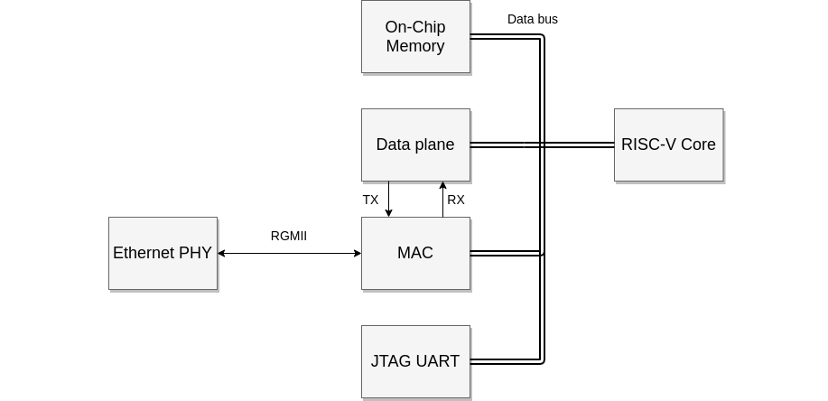
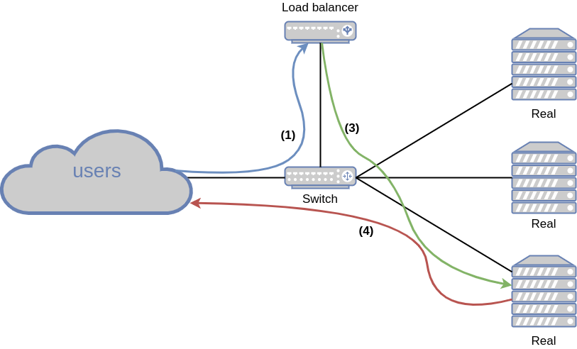

# FPGA Load Balancer
This a network layer 4 load balancer written on FPGA. The purpose of this project was to create a proof of concept rather than a fully featured product. It was created as part of the FPGA Programming course that I have taken on my university.

#### Specs
* Hardware part mostly written in [Hardcaml](https://github.com/janestreet/hardcaml) (a domain specific language based on OCaml).
* Fully pipelined and takes ~30 cycles to process one packet.
* Uses a RISC-V soft core ([VexRiscv](https://github.com/SpinalHDL/VexRiscv)) to control the load balancer.
* Software running on the core uses [FreeRTOS](https://www.freertos.org/) kernel and is written in C.
* Written for [Altera DE2-115](https://www.terasic.com.tw/cgi-bin/page/archive.pl?Language=English&CategoryNo=139&No=502&PartNo=2) FPGA board.

## Description
### System overview

The main part of the load balancer is the data plane. It contains all the logic required to forward a packet. The MAC ([Triple-Speed Ethernet Intel® FPGA IP](https://www.intel.com/content/www/us/en/products/details/fpga/intellectual-property/interface-protocols/triple-speed-ethernet-mac.html)) is connected to the data plane through streaming interface and to the Ethernet PHY chip, through RGMII interface.

The RISC-V core is used to control the load balancer and to communicate with a PC through JTAG. Internally, it uses AvalonMM interface as a bus.

There are two clocks domain: the fast one used on the datapath, that is in the MAC and in the data plane, and the slower one used for the remaining logic.

### Layer 4 load balancing
The load balancer works on the Transport Layer, i.e. is oblivious to the data that is being sent. It works in DSR (direct service response) mode. 

The following diagram show how the balancer operates: 

**Steps**:
1. Receive a packet with the destination configured as a VIP (virtual IP address - IP address of the service).
2. Choose a real server - calculate a hash value from 4 values (src ip, dst ip, src port, dst port) and based on this hash value pick a server. With that, packets from the same session will be sent to the same real.
3. Encapsulate packet in another IP packet and send to the real.
4. Real server process the packet and replies directly to the user.

The data plane lookups for a real using a hash ring, which is configured by the core. In practice, a consistent hashing algorithm should be used here, but for the sake of simplicity, the hash ring is programmed in a naive way - every entry of a hash ring is specified manually.

The balancer can handle multiple VIPs (i.e. multiple services with different IPs) with separate collections of real servers.

## Project structure
The project is divided into several components, each of them located in a separate directory. For more detailed description, please refer to the README in a sub-directory.

* [env](env) - scripts for creating a Docker image with all tools, packages and toolchains required to build the project
* [hardcaml](hardcaml) - hardware design of the load balancer
* [ip](ip) - IP components used in the project
* [monitor](monitor) - a tool communicating with the balancer through UART. Used for monitoring and sending commands
* [quartus](quartus) - all files related to synthesis: Quartus Project Files, QSF files, SDC files. It also contains the description of the [
Platform Designer](https://www.intel.com/content/www/us/en/software/programmable/quartus-prime/qts-platform-designer.html) system used for interconnecting logic to intellectual property functions and subsystems.
* [rtl](rtl) - Verilog source files with the top-level module and a few other auxiliary modules
* [sim](sim) - a simulator of the RISC-V core
* [spinal](spinal) - configuration of the VexRiscv core
* [sw](sw) - the software running on the soft-core
* [tools](tools) - miscellaneous tools and scripts

## Building and running
Please note that the only supported FPGA board is Altera DE2-115.

The build system works well, but it is not perfect. Therefore, to build the project you have to follow the steps:
1. Ensure you have all tools set up (the easiest way is to work in the provided Docker container)
2. Build the data plane - run `make` in *hardcaml* directory.
3. Build the software - run `make` in *sw* directory.
4. Build the quartus project - run `make` in *quartus* directory.

These commands will generate all Verilog sources, synthesize them, perform P&R and timing analysis and generate a bitstream ready to program a FPGA. Then simply run `make program` in *quartus* directory to load the bitstream.

### Simulation and testing
A simple framework for testing the RISC-V core is located in [sim](sim) subdirectory. All bus slaves that are normally connected to the core are emulated in the software. [Verilator](https://www.veripool.org/verilator/) is used to compile HDL sources of the core to C++ code.

Separately, there is a simulator for the data plane. It is written exclusively in Hardcaml in a form of testbenches. Some of them are fine-grained (testing a single circuit) and some other are more comprehensive. There is one big regression test of the whole data plane, which simply injects data stream into the data plane and verifies if the output is correct.

Also, there is a possibility to mount the load balancer natively in the Linux's networking stack. The code in the directory [hardcaml/test/tap](hardcaml/test/tap), creates a [TAP](https://en.wikipedia.org/wiki/TUN/TAP) tunnel device, receives packets from that device, forwards them through the simulated load balancer and puts outgoing packets back in the TAP device. Effectively, it allows to test the load balancer as if it was a normal physical device. With that, Linux utility tools for network operations become very handy.

## Results

#### Resource utilization
| Resource     |      LUTs      |  Registers   | Memory |
|--------------|:--------------:|:------------:|:-:|
| Whole system |  24211 | 22249 | 830 Kbit |
| Data plane   |  11685   | 10927 | 2.9 Kbit |

The data plane runs at 100 Mhz (fmax is ~125Mhz and is limited by Intel's MAC). Everything else runs at 50 Mhz.

The maximum throughput achieved on the FPGA board is 1 Gbit/s and 1.56 Mp/s, which is reasonable, because the PHY chip located on the board supports only Gigabit Ethernet. However, the theoretical throughput of the data plane is 4 Gbit/s and 6.25 Mp/s (assuming UDP packets with payload of 16 bytes). These numbers could be scaled up even further, by increasing the data path width (which is now equal to 32 bits).

## Unsupported features
As this was only a half-semester project, I had a limited time to work on it. It was never meant to be fully working load balancer, but rather an opportunity to learn Hardcaml and how to program FPGAs in general. Therefore, many crucial features are missing, including:
* Packet fragmentation
* IPv4 header checksum validation
* Reasonable VIP management (right now, only 8 VIPs can be programmed and 32 real servers)
* Consistent hashing
* Simulation of both the load balancer and the core
* and many many more ...

## License
This project is MIT licensed, as found in the LICENSE file.