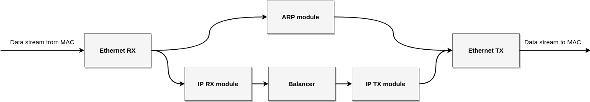
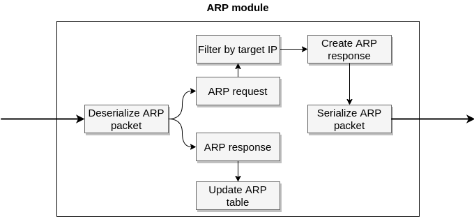

# Hardware Design
Here is located the hardware design of the load balancer's data plane. It is written in [Hardcaml](https://github.com/janestreet/hardcaml) - an OCaml library for designing hardware.

## Building
Run `make` to generate Verilog sources.

## Architecture
The primary goal of this project was to have a fully pipelined data path, which means that the data plane can accept new data each cycle without stalls. Reasoning about a hardware circuit at the level of register transfers is difficult, especially if you want to achieve stall-free pipelines. There are so many things happening at once, so trying to understand the state of a circuit is almost impossible (at least for me) when you think about it in terms of wires and registers. Therefore, I needed to create some abstractions on top of it. 

The most basic primitive is *Transaction*. It denotes a unidirectional transfer of data, but with two extra 1-bit signals of self-descriptive names - *valid* and *ready* set respectively by the sender and the receiver. Thank to expressive and rich Ocaml's type system, defining a new *Transaction* type is easy as:
```ocaml
module IPv4_hdr = Transaction.Make(Common.IPv4Header)
```
and then we can safely use this module with a guarantee that signals won't be accidentally connected to something wrong. `Common.IPv4Header` is a Hardcaml interface representing data that is being sent.

On top of that, I have created an abstraction for a data stream, *Flow*, which in fact is a transaction with stateful data (data with some metadata like whether the first word is currently being sent or last one, etc.).

With that, many interesting and handy functions operating on these abstractions could be created. To name a few:
* mapping transactions from one type to another,
* forking a single transaction to many children,
* joining transactions together,
* filtering, arbitrating, dispatching,
* synchronizing flows with transactions,
* buffering (to cut combinatorial path and to hide latencies).

The thing I like the most about it is that it resembles the functional programming paradigm. Just consider the following excerpt from the `ip` module:
```ocaml
let ip_hdr, arp_query_req = Transaction.fork_map
    (module IPv4_hdr) (module Arp.Table.ReadPort.Req) ip_rx.hdr
    ~f:(fun hdr -> {Arp.Table.Key.ip = hdr.dst_ip})
in

let ip_hdr = 
    IPv4_hdr.map ip_hdr ~f:(fun data -> { data with hdr_checksum = zero 16}) |> 
    IPv4_hdr.map ~f:(fun data -> { data with hdr_checksum = calc_checksum (module Signal) data}) |>
    IPv4_hdr.bufferize spec
in
```
It firstly forks the IP header in two transactions - one of them is mapped to an ARP table request right away, the second one is further processed.

Not only does it look pretty, but also it hides all details about registers, logic gates, and wires under the abstraction. It took me a few weeks to realize that in fact, I created a framework for a well-known architecture (at least for people interested in computer architectures) - [the dataflow architecture](https://en.wikipedia.org/wiki/Dataflow). 

### Data plane
The structure of the data plane is very simple and the best way to visualize it is using data-flow diagrams (since it was created in a data-centric manner):



Each of these blocks could be zoomed in to show more fine-grained diagrams. For example, one of the simpler modules, the ARP module, consists of:



This diagram is approximately the 1-1 representation of the code describing this circuit, which makes it much easier to understand what is happening there (compared to regular Verilog code).

## Testbenches
There is a number of testbenches - both unit tests for single modules and regression tests for making sure that the data plane forwards packets correctly after any change. I have learned that these are crucial when writing hardware. When you make a change (and you don't have tests) and a quite big circuit stops working, it is almost impossible to find the bug. Even finding the broken part can be an arduous task. Contrary to software where you can trace each instruction executing one after another, in hardware you have hundreds (or even thousands) wires changing their state in each cycle. When looking at plain signals on a waveform, it is really hard to tell what is going on. Sometimes I even improperly thought that I found a bugged signal, but in reality, it was not bugged, but due to high parallelism, it already was processing the next batch of data.

The conclusion is that writing a bunch of unit tests to all important modules was a key part of the success of this project.  

## Why Hardcaml?
Since Hardcaml is not the most common HDL language, I would like to write a few words about why I chose it.

Having written a few smaller projects in Verilog, I felt like this language has stopped in the 90s. It was like writing a software app in C or even assembly code. You can express any idea you want, but probably it wouldn't be the cleanest and easiest way to do so. Verilog lacks abstractions, polymorphism, and all these neat features that can be found in modern programming languages. The funny thing is that despite the fact that Verilog was not created to synthesize, but to simulate hardware, writing simulations, and testbenches is not easy and pleasant at all. Therefore, I needed another hardware description language.

I immediately rejected [HSLs](https://en.wikipedia.org/wiki/High-level_synthesis) - I didn't like the idea. I felt I have too little control of what I can express.

There was a plethora of DSL to choose from. On the one hand, there are languages based on Python (like Magma and Migen), but in my opinion, it joined drawbacks from both Verilog and Python - e.g. Verilog style of writing hardware and weak typing. On the other hand, there is Clash (I know, it is not a DSL), but for me, it was too complex to understand. There were other languages under consideration like Chisel, but in the end, I decided to try Hardcaml - one of the reasons was that I did not know OCaml, but I had to learn it anyway.

Hardcaml turned out to be the golden mean - it is very expressive, has a rich type system, and all the goodies that come with OCaml. You can use higher-order functions, first-class modules, polymorphism, and all these things integrate nicely with Hardcaml (and are truly useful). It just feels like this was designed by people who have good taste and experience in programming languages.

Unfortunately, Hardcaml is not perfect. The biggest problem for me was the high entry threshold. Hardcaml practically has no community and as the result, the docs are not extensive (but they are OK) and what was worse for me, literally there is not a single big project written in Hardcaml. That would be extremely helpful at the beginning just to see and learn what are techniques, conventions and tricks when writing something bigger. For that reason, I decided to open-source this load balancer project with the hope that it will be educational and useful for somebody. I think Hardcaml is a language worth sharing with others and hopefully, it will gain broader recognition.